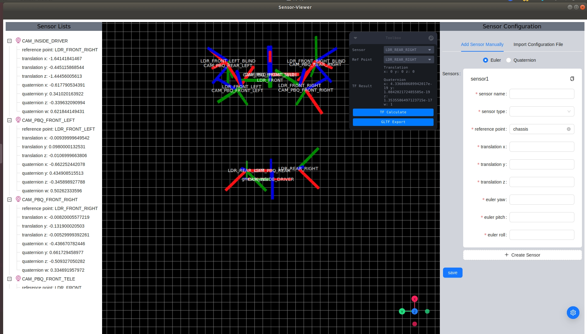

# Sensor-Viewer

[中文](./README.zh_CN.md)



## Feature

-   Supports adding, editing, checking, location preview, hiding/showing of vehicle sensors
-   Support any sensor and reference point for transform calculation
-   Support Euler and quaternion rotation methods
-   Supports sensor configuration file import and export
-   Support GLTF model file export

## Download

### Download via [release](https://github.com/neo896/Sensor-Viewer/releases)

### Build from source

1. Prerequisites

-   [nodejs](https://nodejs.org/en)
-   [tauri](https://tauri.app/v1/guides/getting-started/prerequisites)

1. Clone source code

```bash
git clone https://github.com/neo896/Sensor-Viewer.git
```

2. Installation dependencies

```bash
npm install
```

3. Run

```bash
npm run tauri dev
```

4. Build

```bash
npm run tauri build
```
