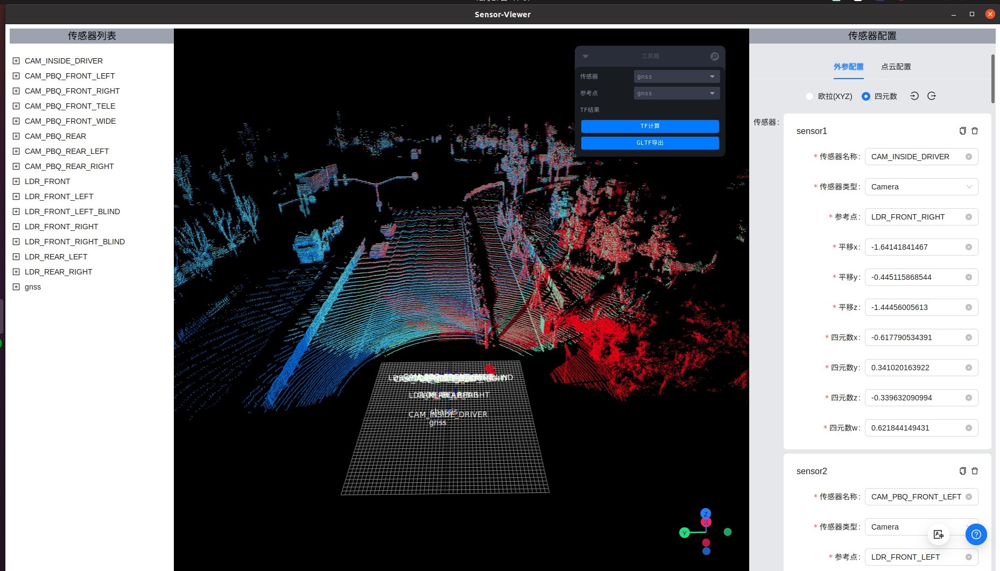

# Sensor-Viewer

<center><em><b>基于 Transforms 变换的轻量级、快速、跨平台传感器位置可视化工具</b></em></center>



## 功能

-   支持车载传感器的添加，编辑，检查，位置预览，隐藏/展示
-   支持任意传感器和参考点，进行 transform 计算
-   支持欧拉旋转和四元数表达方式
-   支持传感器配置文件导入，导出
-   支持 GLTF 模型文件导出

## 下载

### 通过[release](https://github.com/neo896/Sensor-Viewer/releases)直接下载

### 从源码编译

1. 预置条件

-   [nodejs](https://nodejs.org/en)
-   [tauri](https://tauri.app/v1/guides/getting-started/prerequisites)

1. 克隆源码

```bash
git clone https://github.com/neo896/Sensor-Viewer.git
```

2. 安装依赖

```bash
npm install
```

3. 运行

```bash
npm run tauri dev
```

4. 构建

```bash
npm run tauri build
```
